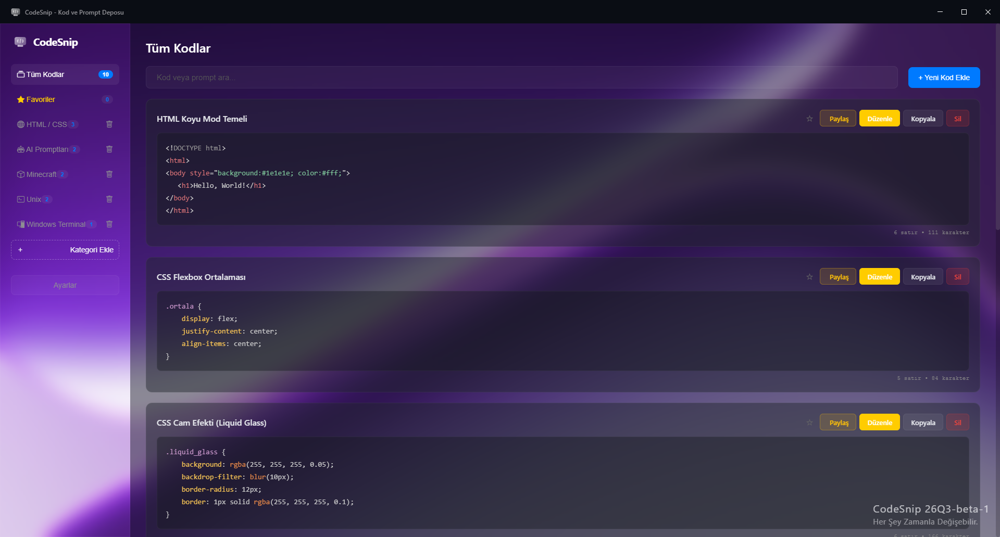
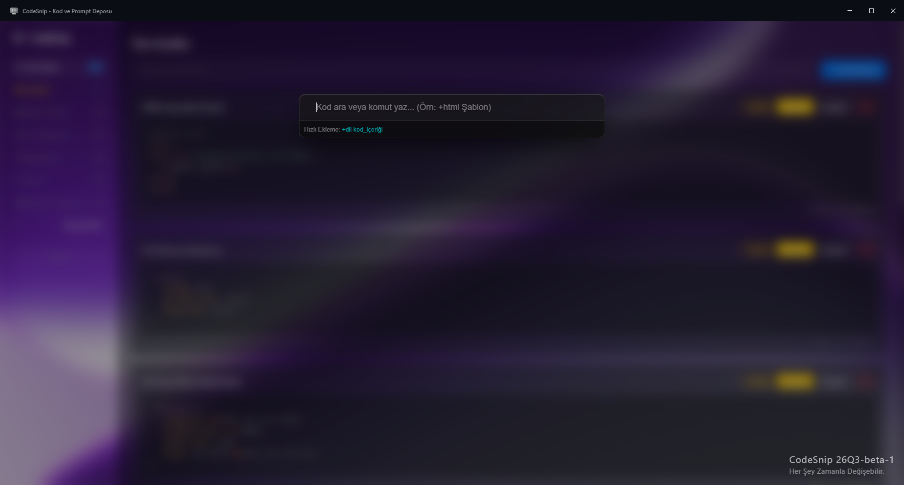

# CodeSnip — Next-Generation Code & Prompt Manager

<p align="center">
  
  
  
</p>

<p align="center">
  <a href="README_tr.md"></a>
  <a href="README.md"></a>
</p>

> [!IMPORTANT]
> **Starting July 10**, all bugs reported by the community will be verified by the development team, then categorized and assigned an ID in the `CBug-[number]` format.
> For more details, <a href="https://github.com/Light-Bulb-Team/CodeSnip/discussions/6">click here.</a>

## ㅤ

<p align="center">
  A modern, fast, and fully offline desktop application for managing code snippets and AI prompts.<br>
  Organize, search, and share your code snippets, terminal commands, and prompts—all in one place.
</p>


## About

CodeSnip is a modern Electron application designed for developers, designers, and AI enthusiasts.
Organize your code snippets into categories, search them instantly, copy them with a single click, and generate Base64-based sharing links.
All data is stored locally on your device, allowing the application to work without an internet connection.

> [!NOTE]
> Since CodeSnip runs entirely offline, your data always stays on your device.

---

## Features

- Liquid Glass (Frosted Glass) user interface
- Global Spotlight Search (`Ctrl + Space`)
- Base64-based sharing system
- English and Turkish language support
- Fully offline operation
- Local data storage
- Built-in category system
- Fast search and filtering
- Electron-based desktop application

---

## Installation

### Requirements

- Node.js (v18 or later)
- npm

### 1. Clone the repository

```bash
git clone https://github.com/MstfSlm38/CodeSnip.git
```

### 2. Navigate to the project folder

```bash
cd codesnip
```

### 3. Install dependencies

```bash
npm install
npm install electron --save-dev
```

### 4. Build the production package

```bash
npm run dist
```

---

## Screenshots

<p align="center">

<br><br>

</p>

---

## Beta Screenshots
>[!WARNING]
>These are the beta screenshots. It's all subject to change!

<p align="center">

<br><br>

</p>

---

## Keyboard Shortcuts

| Shortcut | Description |
|----------|-------------|
| `Ctrl + Shift + S` | **Global Shortcut:** Brings CodeSnip to the foreground and opens Spotlight Search, even when the application is running in the background. |
| `Ctrl + Space` | Quickly open or close the Spotlight Search panel while using the application. |
| `Esc` | Close the currently open Spotlight Search panel. |
| `Space` | Open the **Quick Look** preview for the selected snippet while navigating Spotlight Search results. |
| `Arrow Up / Down` | Navigate through Spotlight Search results. |
| `Enter` | Send the selected snippet to the main search bar. If the selected item is in the `+category` format, it instantly creates a new snippet under that category. |

---

## Technologies Used

- Electron
- JavaScript
- HTML5
- CSS3
- Node.js

---

## Roadmap

- [x] v1.0 — Initial Release
  - [x] v1.1 — Bug Fixes & Favorites Feature

- [x] 26Q2 (v2.0) — Spotlight Search, Sharing System, and Redesigned Liquid Glass UI
  - [x] 26Q2.5 — JSON Import/Export, Improved Spotlight Search, and Versioning System Update

- [ ] 26Q3 —  and Linux (Debian, Arch, Red Hat) Support, Improved Appearence and new Category Management
- [ ] 26Q4 — App Optimization, macOS Support and Full Support for Linux (Slackware and Gentoo)
- [ ] 27Q1 — Plugin System and Snippet Previews

> [!NOTE]
> The roadmap may change over time as new features are added or bugs are discovered.

---

## Contributing

Want to help improve CodeSnip?

- Fork this repository.
- Create a new branch for your feature.
  ```bash
  git checkout -b feature-name
  ```
- Commit your changes.
  ```bash
  git commit -m "Add awesome feature"
  ```
- Push your branch.
  ```bash
  git push origin feature-name
  ```
- Open a **Pull Request**.

If you find a bug, feel free to report it through the **Issues** section!

## License

This project is licensed under the MIT License. See the [LICENSE](LICENSE) file for more information.

## Developers

- Mustafa Selim AYDENİZ
- Ali Kerem YILMAZ
